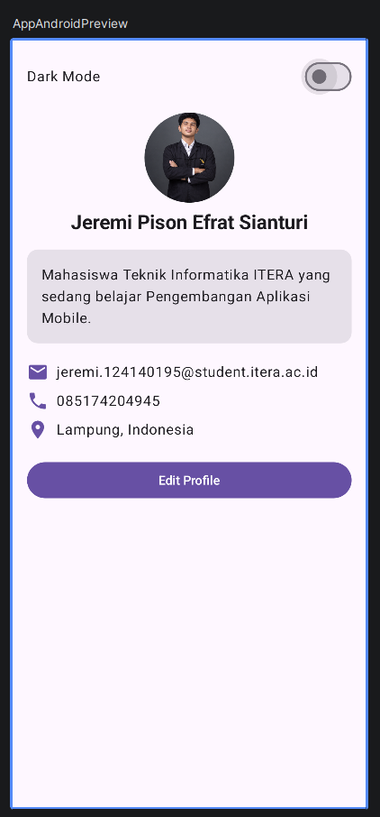
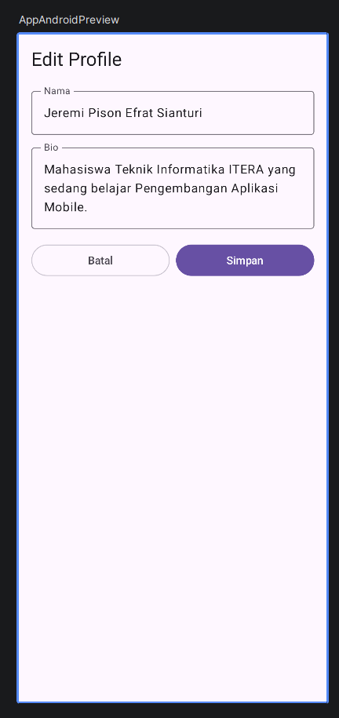
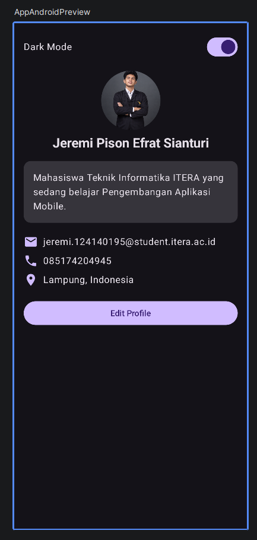

# TUGAS 4 Pengembangan Aplikasi Mobile

**Nama:** Jeremi Pison Efrat Sianturi
**NIM:** 124140195
**Kelas:** RA

## Deskripsi Tugas

Mengembangkan Profile App dari Tugas 3 dengan fitur:

### 1. Implementasi MVVM Pattern
- **`ProfileViewModel` dengan `StateFlow`**: state disimpan di `MutableStateFlow` (private) dan dibuka ke UI sebagai `StateFlow` (read-only). UI membacanya dengan `collectAsState()`.
- **Data class `ProfileUiState`**: berisi semua state UI, yaitu data profil, status mode edit, isi form (nama & bio), dan status dark mode.

### 2. Fitur Edit Profile
- **Form untuk edit nama dan bio**: dua `OutlinedTextField` di `EditProfileScreen`.
- **State hoisting untuk TextField**: `EditProfileScreen` tidak menyimpan state sendiri. Nilai `TextField` (`nama`, `bio`) dan event perubahannya (`onNamaChange`, `onBioChange`) dioper dari luar, yaitu dari ViewModel.
- **Save button yang update ViewModel**: tombol **Simpan** memanggil `viewModel.simpanProfile()` yang mengubah data profil di `ProfileUiState`.

### 3. Fitur Dark Mode Toggle
- **Switch untuk dark/light mode**: ada di bagian atas halaman profil.
- **State disimpan di ViewModel**: nilai `isDarkMode` ada di `ProfileUiState` dan diubah lewat `viewModel.toggleDarkMode()`. `MaterialTheme` memakai `darkColorScheme()` atau `lightColorScheme()` sesuai nilai tersebut.

## Struktur Folder

```
shared/src/commonMain/kotlin/com/example/tugas4pam/
├── App.kt                      # Menghubungkan ViewModel dengan UI + tema
├── data/
│   └── Profile.kt              # Model data profil + data awal
├── viewmodel/
│   ├── ProfileUiState.kt       # Data class state UI
│   └── ProfileViewModel.kt     # Logika + StateFlow
└── ui/
    ├── ProfileComponents.kt    # ProfileHeader, InfoItem, ProfileCard
    ├── ProfileScreen.kt        # Halaman profil + switch dark mode
    └── EditProfileScreen.kt    # Form edit nama & bio
```

## Alur Data (MVVM)

```
UI (ProfileScreen / EditProfileScreen)
   │  event: klik Edit, ketik TextField, klik Simpan, toggle Switch
   ▼
ProfileViewModel  ──update──▶  MutableStateFlow<ProfileUiState>
   ▲                                   │
   └──────── collectAsState() ◀────────┘  UI otomatis recompose
```

## Screenshot

| Profile View | Edit Form | Dark Mode |
|:---:|:---:|:---:|
|  |  |  |

## Menjalankan Aplikasi

- Android: `./gradlew :androidApp:assembleDebug`
- iOS: buka folder [/iosApp](./iosApp) di Xcode lalu jalankan
